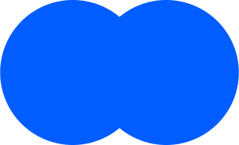
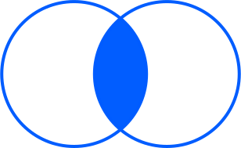
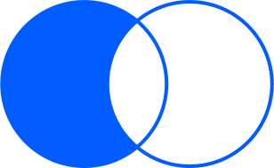
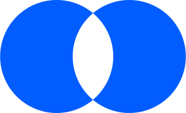
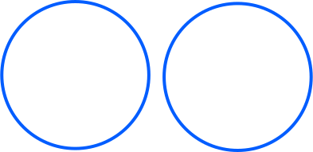
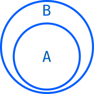
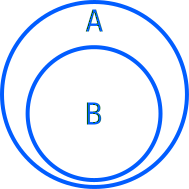

## Contents

### JavaScript
[Table of Array methods and typed arrays support](https://rekzi.github.io/web_experiments/arrays.html)

### Set, WeakSet, Map, WeakMap

|           | Set  | WeakSet | Map      | WeakMap |
|-|-|-|-|-|
add         | ✓    | ✓         | set      | set
has         | ✓    | ✓         | ✓        | ✓
delete      | ✓    | ✓         | ✓        | ✓
size        | ✓    |           | ✓        |
get         |      |           | ✓        | ✓
keys        | ✓    |           | ✓        |
values      | ✓    |           | ✓        |
entries     | ✓    |           | ✓        |
clear       | ✓    |           | ✓        |
forEach     | ✓    |           | ✓        |

#### Set specific methods
| | |
|-|-|
| union                 |  |
| intersection          |  |
| difference            | 
| symmetricDifference   | 
| isDisjointFrom        | 
| isSubsetOf            | 
| isSupersetOf          | 
